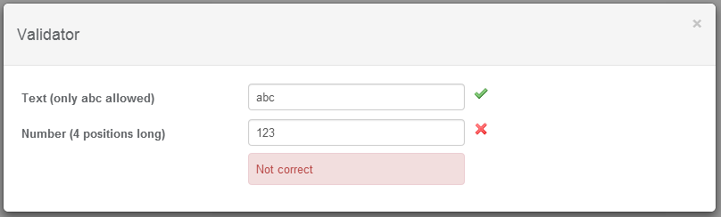
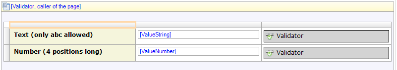

Validator
=========

##Description
This widget makes it possible to have client side validation, so the form is more responsive to fill. 

##Typical usage scenario
When having instant validation on the values being filled be any end user, this widget will provide instant feedback. Since the validation is done client side, make sure the validation is also done from the modeler (server side), so the validation is done properly and complete.

##Instructions
For this widget to work, a css class must be specified to a specific input field. The defined css class must be provided in the properties of the widget.

##Features and limitations
- Validate any value of a field based on regular expressions.
- Supported are Mendix input fields text box, text area and reference selector.
- Supported data types are string, integer, long, float, date and enumeration.

##Screenshots
Client side.

In Mendix page.
